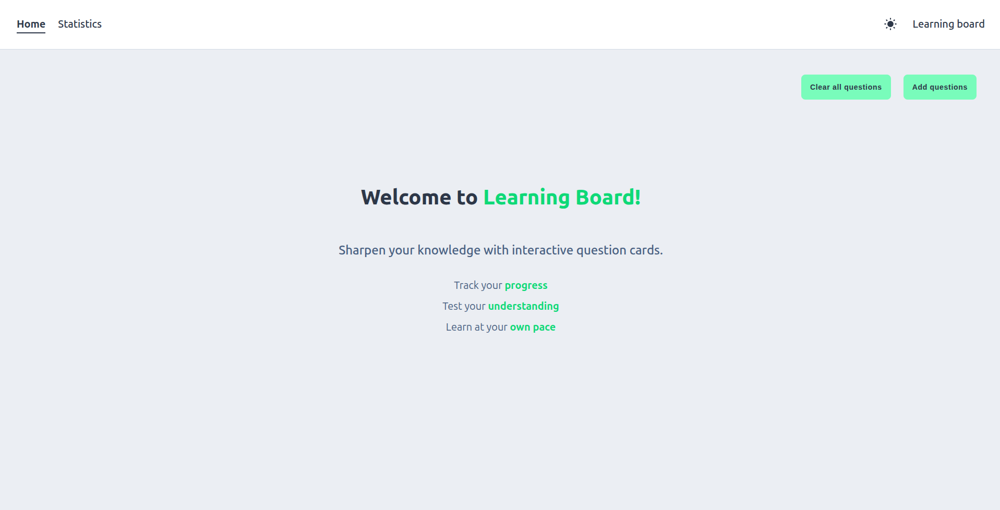
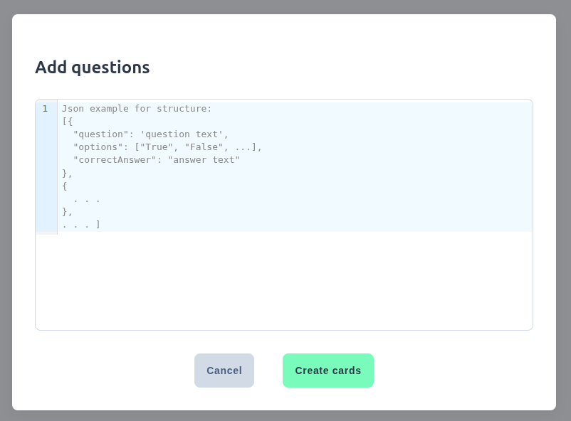
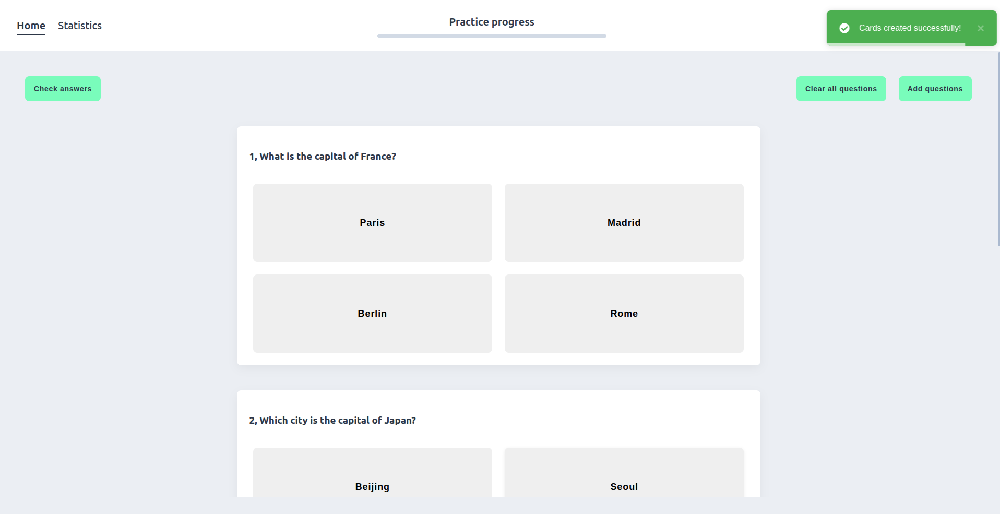
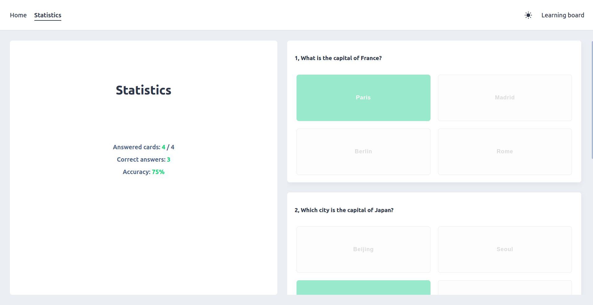

# Learning Board

**Learning Board** is a minimalistic and user-friendly web app designed to help you study through interactive question cards. Add your questions in JSON format and track your understanding in real-time through built-in statistics.






## Features

- Add your own questions using structured JSON
- Interactive answer interface with feedback
- Statistics page to track your learning progress
- Simple, clean UI for focused study sessions
- Light/Dark mode toggle

### Known Limitations

- Currently supports only **one correct answer** per question.
- Multiple correct answers in the `correctAnswer` field are not yet handled.

## Getting Started

### Local development

```bash:
    npm install
    npm run dev
```

### Docker deployment
You can run the app with Docker Compose:
    docker-compose up --build

## Question format (JSON)
```
[
  {
    "question": "What is the capital of France?",
    "options": ["Paris", "Madrid", "Berlin", "Rome"],
    "correctAnswer": "Paris"
  },
  {
    "question": "Which city is the capital of Japan?",
    "options": ["Beijing", "Seoul", "Tokyo", "Bangkok"],
    "correctAnswer": "Tokyo"
  },
  next question structure ...
]
```